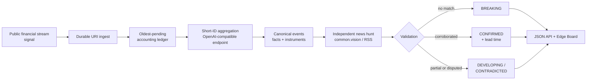

<div align="center">

# FinTick

### The market whispers before the wire catches up.

[](pyproject.toml)
[](https://github.com/msitarzewski/fintick/actions/workflows/ci.yml)
[](pyproject.toml)
[](LICENSE)
[](https://github.com/sponsors/msitarzewski)

</div>

> **Designed by Claude Opus · Built with Qwen 3.8 and GPT 5.6 Sol via Hermes.**

FinTick watches one exceptionally fast public financial stream and measures a useful gap:

> **When did the stream say it, and when did independent news confirm it?**

Every post gets a durable outcome. Repeated posts collapse into one event. Concrete claims become structured facts. Independent news either corroborates the event, disputes it, or stays silent.

That silence matters.

> [!IMPORTANT]
> **BREAKING · no corroboration yet** means the stream may be ahead of the wire. FinTick treats that as a result, not a pipeline failure.

The stream is the signal. External stories with real URLs are sources. FinTick never inflates confidence by counting four rewrites of the same post as four independent confirmations.

## The Edge Board

The browser UI is an auto-refreshing event board rather than a raw feed reader:

- uncorroborated events rise to the top;
- validation status is the visual focal point;
- repetition appears as `via the stream · seen N×`;
- confirmed events show how far the news lagged the stream;
- pipeline health exposes pending, retrying, and terminal outcomes.

The local board runs at **<http://127.0.0.1:8137>**.

## Try it in 60 seconds

FinTick requires Python 3.11 or newer. The fixture demo is offline and needs no account, token, model server, or package install.

```bash
git clone https://github.com/msitarzewski/fintick.git
cd fintick
./run-demo.sh
```

The demo ingests four differently worded NVDA posts, assigns all four to one event with a fixture model response, and starts the Edge Board on port 8137. Open **<http://127.0.0.1:8137>** to inspect the result.

Run the health check and full test suite separately:

```bash
python3 -m fintick doctor
python3 -m unittest discover -s tests -v
```

### Run one pipeline cycle

```bash
python3 -m fintick ingest --fixture reference/nvda_repost_cluster.json
python3 -m fintick aggregate
python3 -m fintick validate
python3 -m fintick serve --port 8137
```

### Run continuously

Run each worker in a separate terminal, or install the user services described below:

```bash
python3 -m fintick ingest --watch
python3 -m fintick aggregate --watch
python3 -m fintick validate --watch
python3 -m fintick serve --port 8137
```

### Provider boundaries

| Stage | Production default | Offline / local path |
|---|---|---|
| Stream ingest | Public Bluesky AppView API, no authentication | Checked-in fixtures |
| Event aggregation | Any OpenAI-compatible endpoint (`FINTICK_LLM_*`) — a free local ollama server by default, or a cloud model like GPT-5.6 Luna | Injected fixture responses or the same endpoint |
| News validation | common.vision Partner API | Direct Google News RSS or stubbed candidates |
| Storage and dashboard | SQLite + Python standard library | The same code path |

Inference is a single forced-JSON call to an OpenAI-compatible chat endpoint — no agent, no shell, no OAuth, no credentials on disk beyond the API key you place in `.env`. Untrusted stream text is treated strictly as content; it never drives tools. Point `FINTICK_LLM_BASE_URL`/`_API_KEY`/`_MODEL` at local ollama (free, the default) or any hosted provider.

When common.vision is configured, publisher identity comes from `article.metadata.source`; `article.feed` is retained separately as ingestion provenance. The feed carrying a story is not counted as another publisher.

## Architecture



## The accountability contract

LLM output is useful only when the system can prove what happened to every input. FinTick wraps model judgment in a strict ledger:

| Invariant | What FinTick enforces |
|---|---|
| Every selected post gets one outcome | assigned to one event, intentionally ignored with a reason, retryably errored, or terminally errored after bounded attempts |
| One post URI belongs to at most one event | ambiguous ownership fails closed |
| Retries preserve context | a failed subset retries as its original group rather than contaminating fresh work |
| Terminal decisions stay terminal | restarts and repeated runs are idempotent |
| Time means UTC instant | mixed timezone offsets cannot reorder pending work, health timestamps, or event spans |
| Social repetition is evidence, not corroboration | only claim-matched external stories can confirm an event |
| Validation owns validation state | aggregation cannot overwrite status or lead time |

The ledger turns model decisions into an audit trail.

### Verified on representative data

The current release candidate has been exercised against a copied-live 1,006-post database:

| Check | Result |
|---|---|
| Post accounting | 1,006 / 1,006 durable outcomes |
| Assigned to events | 283 |
| Intentionally ignored | 45 |
| Historical / out of scope | 678 |
| Pending, retrying, or terminal errors | 0 |
| Posts owned by more than one event | 0 |
| Offline test suite | 143 / 143 passing |

### SQLite model

The database lives at `data/fintick.db`:

- `posts` retains every stream post by immutable URI;
- `post_aggregation_decisions` records the complete accounting trail;
- `events` stores canonical headlines, facts, instruments, status, and lead time;
- `event_signals` maps repeated posts to their single event;
- `event_validations` stores claim-matched external stories with publisher and feed provenance kept separate.

Aggregation uses deterministic event keys and never overwrites validation-owned fields. Validation is safe to rerun: an event can start as `breaking`, become `confirmed` when the wire catches up, or lose stale evidence that no longer meets the claim-overlap standard.

## Unattended operation

The installer writes four rootless `systemd --user` units: ingest, aggregate, validate, and dashboard.

```bash
./setup-fintick-services.sh --dry-run
./setup-fintick-services.sh
systemctl --user status 'fintick-*'
```

| Worker | Default cadence |
|---|---|
| Ingest | poll every 15 minutes and paginate to the last durable URI |
| Aggregate | process the oldest 50 pending posts, then check again every minute |
| Validate | search and revalidate eligible events every 5 minutes |
| Dashboard | serve on loopback port 8137; browser refresh every 20 seconds |

### A handoff that can say "no"

The installer treats service replacement as a transaction rather than a pile of shell commands:

1. Preflight rejects live worker processes, port collisions, dormant Supervisor definitions, unsafe credential files, and uncertain system state.
2. SQLite's online backup API captures committed WAL data before anything changes.
3. Replacement units must remain active through bounded liveness checks.
4. The dashboard must prove it serves the exact operational database by device and inode identity.
5. Post accounting must conserve the corpus, and a pre-existing backlog must move.
6. On failure, replacements are proven stopped before the database family and prior unit state are restored.

Rollback is fail-closed. Prior writers restart only after database recovery, unit-artifact restoration, and `daemon-reload` all succeed. Persistent and runtime masks are preserved exactly. Uncertain or transitional unit states produce an incomplete rollback with private evidence retained; they are never interpreted as success.

> [!NOTE]
> Only the validation unit reads `%h/.config/fintick/environment`. If you enable common.vision, create that file with a secure editor, set mode `0600`, and add `FINTICK_COMMON_VISION_TOKEN`. The installer verifies path, type, owner, and mode without reading the token value.

### Model benchmark

The fixed 28-post corpus exercises the same short-ID parser and accounting contract used in production:

```bash
# Uses FINTICK_LLM_* from the environment (local ollama by default):
python3 -m fintick.benchmark
# Or point it at a specific endpoint/model:
python3 -m fintick.benchmark --base-url https://api.openai.com/v1 --model gpt-5.6-luna
```

The benchmark prints aggregate metrics only. Raw model responses are not written to the repository.

## Repository map

| Path | Purpose |
|---|---|
| [`PRD.md`](PRD.md) | product contract and acceptance criteria |
| [`STATUS.md`](STATUS.md) | verified release state and operational evidence |
| [`AGENTS.md`](AGENTS.md) | engineering, integrity, inference, and service rules |
| [`reference/nvda_repost_cluster.json`](reference/nvda_repost_cluster.json) | canonical four-post aggregation fixture |
| [`reference/common_vision_partner_api.md`](reference/common_vision_partner_api.md) | credential-free Partner API contract used by validation |
| [`tests/`](tests/) | offline acceptance, accounting, validation, dashboard, and handoff regressions |

## Related work: Agency Agents

[Agency Agents](https://github.com/msitarzewski/agency-agents) is Michael's open library of specialized AI agent personalities, processes, and deliverables.

[](https://github.com/msitarzewski/agency-agents)
[](https://github.com/msitarzewski/agency-agents)

FinTick is a focused operating system rather than an agent catalog, but the projects share a bias: specialized intelligence should produce work you can inspect, test, and use. Agency Agents is related work, not a FinTick runtime dependency.

## Support the work

If FinTick or Agency Agents helps your work, you can support Michael's open-source projects through GitHub Sponsors.

[](https://github.com/sponsors/msitarzewski)

## The collaboration

Claude Opus designed the product and acceptance contract. Qwen 3.8 and GPT 5.6 Sol built and hardened FinTick through Hermes. Michael set the taste, reframed the stream as signal rather than "sources," and kept the work honest: runnable systems over AI theater.

That provenance is part of the project, not decorative copy. FinTick was built by making model output answer to fixtures, ledgers, tests, copied-live data, and independent review.

## License

[MIT](LICENSE) © 2026 Michael Sitarzewski.

FinTick is financial event-intelligence research software. It does not place trades and is not investment advice.
